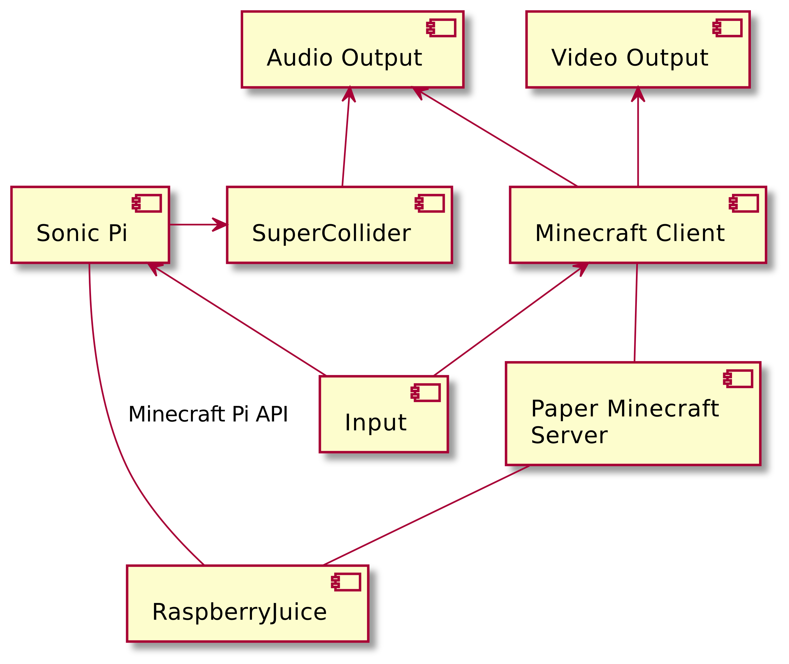
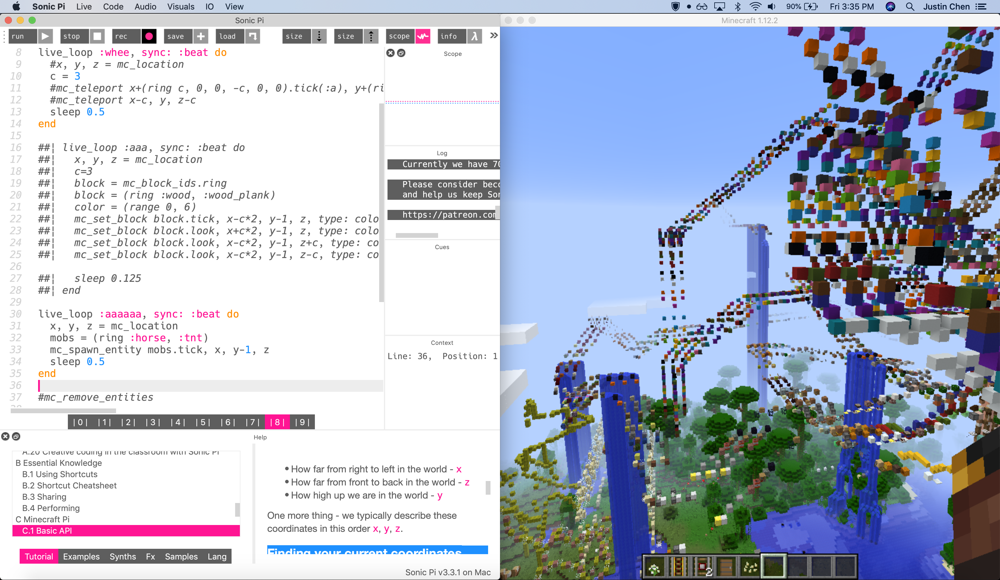

# Live Coding in Sonic Pi and Minecraft

_by Justin Chen  
COMS BC3430 (Computational Sound) Final Project  
Barnard College of Columbia University_

[Sonic Pi](https://sonic-pi.net) is a live coding language and IDE based on Ruby, created by Sam Aaron for both Raspberry Pi and desktop computers. It is primarily a language for live coding visuals. However, on the Pi, it also has basic support for Minecraft Pi Edition through the Minecraft Pi API. This is intended as a Python API, but is built on a basic HTTP API, which is what Sonic Pi uses in its Ruby scripts to interact with Minecraft. Using this, we can teleport the player around, detect and place blocks, and more.

Minecraft is the best-selling video game of all time, in large part because of its unique capabilities in enabling player expression and visual creativity in a voxel world. By fusing the art of live coding with the art of Minecraft, my hope is to create a unique and entertaining audiovisual performance.

## Technical Overview

Unfortunately, I do not have a Raspberry Pi. However, support for the Minecraft Pi API has been created for Minecraft Java Edition with the [RaspberryJuice plugin](https://www.spigotmc.org/resources/raspberryjuice.22724/) for Bukkit servers. It also extends the Pi API with additional features, such as support for spawning entities in the game. By integrating these features into Sonic Pi, I was thus able to experiment with a completely novel art form.

The original/official version of RaspberryJuice only has support through Minecraft 1.12 (after this version, block IDs were completely revamped in what is known as "The Flattening"). Although some forks exist which update RaspberryJuice to later versions, I chose to stick with the 1.12 plugin because it is known to be stable, and furthermore does not require me to completely redo the block name - block ID mappings in Sonic Pi (the block IDs in Minecraft Pi Edition API correspond to the same old block IDs in Minecraft Java Edition). Additionally, Minecraft 1.12 was a particularly stable and performant version, which is helpful for my live coding performance because the game does not lead to memory throttling or otherwise lag out my computer.

I ran RaspberryJuice on a [Paper](https://papermc.io) server, which is a Bukkit/Spigot fork geared toward high performance and is the currently favored version of Bukkit. RaspberryJuice connects on a different port from the Paper server, mimicking the behavior of Minecraft Pi Edition. Sonic Pi is thus able to connect to RaspberryJuice via HTTP, the same way that it would have connected to an actual Minecraft Pi Edition instance. Simultaneously, it could connect to its built-in SuperCollider server to generate musical output. I used a split-screen view to display both Sonic Pi and Minecraft simultaneously, and used audio from both in my performance.

### A Note on Security

Recently, [a major security vulnerability was discovered in Log4j](https://arstechnica.com/information-technology/2021/12/minecraft-and-other-apps-face-serious-threat-from-new-code-execution-bug/), a popular logging library used ubiquitously. Members of the Minecraft Java Edition technical community were some of the first to sound the alarm on this zero-day and release patches for this vulnerability, which allows for arbitrary code execution on both Minecraft server and client host machines.

However, because I am using an older version of Paper, it did take some time for the fix to be propagated over to 1.12\. For a time, the server download was removed entirely. The download is now back up, and according to the Paper official Discord server, should be patched.

Nonetheless, Paper does not offer support for the 1.12 server version nor offer any guarantees of safety. Additionally, server plugins may still be vulnerable if they use vulnerable libraries, and I have not checked RaspberryJuice's source code thoroughly enough to be sure of its safety. Therefore, if you follow the steps which I took here, please be aware that you are doing so at your own risk. If you are sufficiently paranoid, you may wish to refrain from live coding in Minecraft 1.12 when on an insecure network.

## Extending Sonic Pi

Minecraft Pi Edition is a very stripped down version of Minecraft, and the Sonic Pi API reflects that. It is based on an Alpha version of Pocket Edition Minecraft, which would later go on to become the foundational code of Bedrock Edition, which is used on consoles, mobile devices, and Windows computers. However, Pi Edition takes the opposite approach and removes many features from the game, eliminating mobs and other entities as well as having a very reduced block palette.

Therefore, when live coding in Minecraft Java Edition, it is greatly helpful to extend the API to add support for all the 200+ blocks which have been added to the game up to 1.12\. (This number has since blown into the thousands as of the latest version of the game, 1.18, so this older version of Minecraft is somewhat helpful in reducing the tedium as we build our proof of concept as well). We would also like to add support for RaspberryJuice's entity API so that we can spawn entities and other mobs, which are not present in Pi Edition.

Thankfully, the Pi Edition API on Sonic Pi is simply a couple of Ruby scripts that are loaded on launch. As such, all we need to do is directly modify the files in a release of Sonic Pi; we don't even need to build anything! (There is also additional compiled C++ code which adds autocomplete features, but this is unnecessary to work with for our purposes.)

A diff of the changes which I made can be found in [this commit on GitHub](https://github.com/justinbchen/sonic-pi-minecraft/commit/c822c3e526502d948ead558330843d51b08f8011). I added block id, block type, and entity id mappings to their names, making use of the [Java Edition data values/Pre-flattening](https://minecraft.fandom.com/wiki/Java_Edition_data_values/Pre-flattening) article on the Minecraft Wiki. I additionally added support for spawning and removing entities through RaspberryJuice's API. Some challenges in this implementation included making sense of Sonic Pi's custom socket functions for its Minecraft support, and dealing some inaccurate documentation on RaspberryJuice, which had incorrect names for some of its entity-related functions.

## Practicing and Performing in Sonic Pi and Minecraft

I practice in Sonic Pi and Minecraft before, concurrently with, and after extending the language. As my prior live coding experience had bee in [Tidal](http://tidalcycles.org), this presented a new and interesting experience. It took quite some time to wrap my head around the imperative, concurrency-based model that Sonic Pi used. (The functional, cycle-based model of Tidal still feels easier to use to me.)

My stats on MultiMC indicate that I spent at least over 9 hours practicing in Minecraft 1.12, and even more time was spent practicing in Sonic Pi. I stayed fairly simple with the kinds of synths used, preferring to explore the tones, scales, and chords in my live loops to create odd harmonies. I reversed a ring and played notes with pan set to -1 and 1 to imitate the jux rev effect in Tidal.

I used add chords and pentatonic scales, often stacked on top of each other, to create an interesting, dissonant effect. In my actual performance, I accidentally forgot to sync my notes with my beat. However, this ended up being a blessing in disguise. During practice sessions, I noticed that the beat became indistinguishable from the notes, and the note on the beat just ended up sounding accented. This change allowed the beat to become distinct. More importantly, the slight out-of-sync nature of the music complemented the slight latency of the movement in Minecraft. Furthermore, it helped contribute to the off-kilter feeling of the entire performance, which featured some incredibly absurdist content.

On Minecraft, I played around with various ideas. I considered and tested out detecting the type of block under the player and playing a note based on that, but the connection was often not interesting since large parts of the floor are made of the same kinds of blocks. I did attempt variation on this, but then the connection was not particularly clear.

Ultimately, I settled on teleporting the player around while spawning blocks around them at a fast pace. I could select from all block types, or narrow down to specific kinds. I enjoyed using concrete and looping through all the different colors of it. Flying against the teleportation created a nice reepating loop effect, as motion in a certain direction could reset and repeat. I could also stop the teleportation and fly around manually, which allowed for the creation of interesting and organic color trails. It was also fun to use concrete powder, as it would immediately fall and create a nice animation.

Similarly, I performed regular entity spawning while moving around. I could take advantage of not only the falling animation but also the sounds of the mobs. Unfortunately, much of these sounds involved them taking suffocation or fall damage and dying, which was midlly horrifying. With the large number of mobs, I also needed a way to get rid of them. The RaspberryJuice API uses Bukkit to get rid of then entities, but the entities don't disappear properly on the client side until a reload. As such, I used Minecraft commands to kill the entities instead.

I also created large plates of random blocks by following [the official Sonic Pi tutorial](https://github.com/sonic-pi-net/sonic-pi/blob/dev/etc/doc/tutorial/A.08-minecraft-vj.md). Instead of choosing the block randomly, I set the block to concrete and randomly chose the color. These created large impressive random displays, which also became a bit violent as mobs spawned in them and began suffocating.

A spontaneous part of the performance happened when I first came across a village while practicing. Something clicked, and (as the official Sonic Pi mission statement says) I was truly able to let my inner ten-year-old loose. I changed the blocks to TNT, and cackled immaturely as explosions rained upon the world.

## The Future of Live Coding Minecraft

I had a lot of fun live coding in Sonic Pi and Minecraft, and I feel that I have had the opportunity to greatly express my creativity through it. My hope is that this proof of concept, showing how easy and cool it is to improvise art in this medium, will soon be replicated in algoraves around the world.

Alas, this future seems increasingly unlikely. Earlier this month, in response to Minecraft Pi Edition no longer being supported on the latest Raspberry Pi OS, Sam Aaron removed support for the Minecraft Pi API on Sonic Pi. It may be that future generations of live coders may never see this opportunity to fuse these two art forms together, and this already-obscure performance medium may be lost to time.